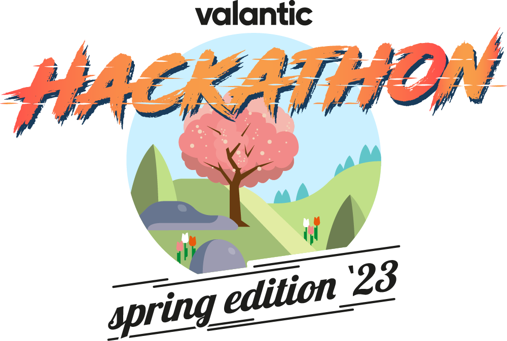

# Hackathon POC for typesense



## Setup


### Local Setup with devenv

Install devenv: <https://developer.shopware.com/docs/guides/installation/devenv>

```bash
devenv up

docker-compoose up -d # start typesense docker container

cd middelware
composer install
```


## Product import

```bash
cd middelware
console app:product-import
```


## Nuxt

```bash
cd nuxt3

npm install

# Start the development server on http://localhost:3000
npm run dev 
```


